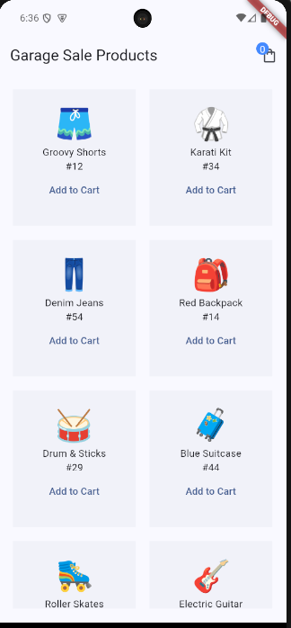
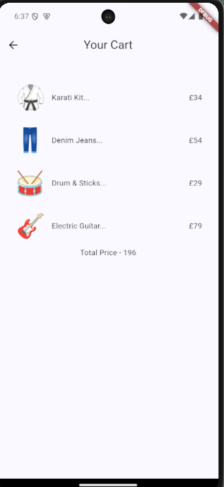

# Riverpod Files: A Simple Flutter Project

This is a simple Flutter project that demonstrates the usage of the Riverpod state management library. This project was created to help you learn about Riverpod and its features.

## Table of Contents

- [Introduction](#introduction)
- [Features](#features)
- [Getting Started](#getting-started)
- [Usage](#usage)
- [Dependencies](#dependencies)

## Introduction

The Riverpod Files project is a basic Flutter application that showcases the usage of Riverpod for state management. It includes a home screen that displays a list of products, and a cart screen that allows users to add and remove products from their cart.

## Features

- Display a list of products
- Add products to the cart
- Remove products from the cart
- Calculate the total price of the cart

## Getting Started

To get started with the Riverpod Files project, follow these steps:

1.  Clone the repository:

`git clone https://github.com/your-username/riverpod-files.git`

1.  Navigate to the project directory:

`cd riverpod-files`

1.  Install the dependencies:

`flutter pub get`

1.  Run the app:

`flutter run`

## Usage

The Riverpod Files project consists of the following screens:

1.  **Home Screen**:
    - Displays a list of products.
    - Allows users to add or remove products from the cart.
2.  **Cart Screen**:
    - Displays the list of products in the cart.
    - Calculates the total price of the cart.

To use the app, simply navigate between the home and cart screens, and interact with the products as needed.

## Dependencies

The Riverpod Files project uses the following dependencies:

- `flutter_riverpod`: ^2.1.3
- `riverpod_annotation`: ^2.0.0
- `riverpod_generator`: ^2.0.0

## media

